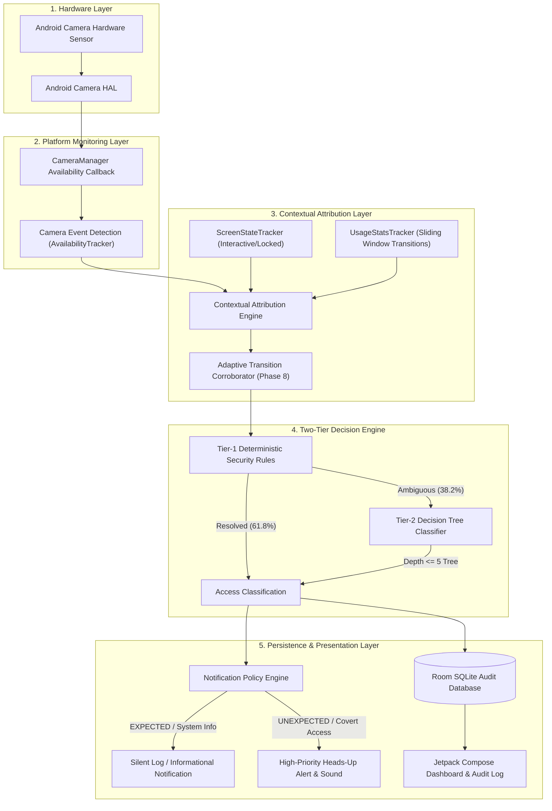

# CameraGuard

**Android Software-Only Camera Privacy Monitor & Research Framework**

[]()
[]()
[]()
[](LICENSE)
[](https://github.com/Sanjaycmd/CameraGuard/releases/tag/v1.1.0)

CameraGuard is an unprivileged, software-only Android camera privacy monitor developed as a final-year cybersecurity research project. It independently observes hardware-level camera activation directly via native platform callbacks, attributes sessions to active and transitioning foreground or background applications, classifies access legitimacy using a two-tier hybrid decision engine (deterministic security rules + decision tree), and provides persistent, tamper-evident audit logging.

Unlike standard Android visual privacy indicators (the green status-bar dot), which merely signal that *some* camera device is open without distinguishing authorized user action from unauthorized background capture, CameraGuard evaluates the full execution context (screen state, foreground transitions, recent user interaction) and alerts users to unexpected camera usage with sub-10ms latency.

---

## 📱 Download CameraGuard

### Latest Release: **v1.1.0 (Reliability & Transition-Aware Attribution)**

No source-code setup, IDE, or build tools are required to install and evaluate CameraGuard.

* **[⬇️ Download CameraGuard APK (`CameraGuard-v1.1.0.apk`)](https://github.com/Sanjaycmd/CameraGuard/releases/download/v1.1.0/CameraGuard-v1.1.0.apk)** — *Main application for users, reviewers, and jury evaluation*
* **[📦 View GitHub Releases Page](https://github.com/Sanjaycmd/CameraGuard/releases/tag/v1.1.0)** — *Release notes, changelog, and checksums*
* **[📂 Local Release Directory](release/)** — *Direct repository mirror of verified release binaries and checksums*

#### Verified Release Binaries & Checksums (SHA-256)

| Asset Filename | Package ID | Size | Target Audience | SHA-256 Checksum |
|---|---|---|---|---|
| **[`CameraGuard-v1.1.0.apk`](https://github.com/Sanjaycmd/CameraGuard/releases/download/v1.1.0/CameraGuard-v1.1.0.apk)** | `org.cameraguard` | 12.3 MB | **All Users & Jury** (Main App) | `e2a8d8f4aace3076cc5e3389eefa360ea984a53ee17e4224a2b2311fda9d5c51` |
| **[`CameraGuard-AdversaryTest-v1.1.0.apk`](https://github.com/Sanjaycmd/CameraGuard/releases/download/v1.1.0/CameraGuard-AdversaryTest-v1.1.0.apk)** | `org.cameraguard.adversary` | 2.6 MB | **Jury Demo & Testers** (Adversary App) | `33b4af8c8106d63daf21a1310e309aa1b7a6152d13018203185bae8e939afa52` |
| **[`CameraGuard-TestHarness-v1.1.0.apk`](https://github.com/Sanjaycmd/CameraGuard/releases/download/v1.1.0/CameraGuard-TestHarness-v1.1.0.apk)** | `org.cameraguard.testharness` | 12.0 MB | **Researchers** (Test Harness) | `91d79177fd98e6d25c958d8dbb08efd4f1af800bdb6fccd6829b788e15dd4a59` |

To verify cryptographic integrity:
```bash
sha256sum -c release/SHA256SUMS.txt
```

---

## 📲 Install & Configure CameraGuard

1. **Download the APK**: Download [`CameraGuard-v1.1.0.apk`](https://github.com/Sanjaycmd/CameraGuard/releases/download/v1.1.0/CameraGuard-v1.1.0.apk) directly on your Android device (or transfer via USB).
2. **Install**: Tap the downloaded APK. When Android prompts *"Install unknown apps"*, allow your browser or file manager to proceed.
3. **Open CameraGuard**: Launch the application from your launcher.
4. **Grant Required Permissions**:
   * **Notifications (`POST_NOTIFICATIONS`)**: Tap *"Grant Notification Permission"*. This allows CameraGuard to post real-time alerts when unexpected camera hardware activity is detected.
   * **Usage Access (`PACKAGE_USAGE_STATS`)**: Tap *"Enable Usage Access in Settings"*. Android will open *Special App Access > Usage Access*. Select **CameraGuard** and toggle **Permit usage access** to ON. *(This unprivileged platform permission allows CameraGuard to identify foreground and transitioning applications accessing camera hardware).*
5. **Start Service**: Tap **"Start Service"**. CameraGuard launches its persistent monitoring service.
6. **Verify Monitoring**: A persistent status notification appears confirming active hardware monitoring.

> **Target Platform**: Evaluated and verified on physical **vivo V2202 (Android 15, API 35)**. Fully compatible with Android 8.0 through Android 15 (API 26–35).

---

## 🔍 Why CameraGuard Exists & What It Detects

### The Problem
Android 12 introduced a system status-bar indicator (green dot) when any application opens the camera. However:
1. **No Contextual Distinction**: The green indicator lights up identically whether the user intentionally opened the stock Camera app or a background spyware service silently activated the camera while the screen was off.
2. **No Persistent Audit Trail**: Android does not provide users with an immutable, inspectable historical timeline of camera hardware activations, exact session durations, and inferred caller packages.
3. **Unprivileged Invisibility**: Traditional security tools require root (`su`) or kernel modifications to inspect camera hardware status, making them impractical for standard user devices.

### CameraGuard's Solution
CameraGuard operates **completely unprivileged** within the standard Android application sandbox:
* **Binary Hardware Detection**: Registers directly with `CameraManager.registerAvailabilityCallback` to intercept raw hardware sensor state changes (`CAMERA_AVAILABLE`, `CAMERA_UNAVAILABLE`).
* **Contextual Correlation**: Intercepts screen interactivity state, device lock status, and `UsageStatsManager` activity transitions within a 5000ms sliding window.
* **Intelligent Classification**: Separates legitimate foreground camera use (`EXPECTED`) from covert background acquisition (`UNEXPECTED`) and ambiguity (`INCONCLUSIVE`).
* **Non-Intrusive Privacy**: Operates without ever capturing a single image or requesting `android.permission.CAMERA`.

---

## 🧩 The Three Applications in this Repository

To maintain strict scientific and demonstrative integrity, the repository is split into three decoupled applications:

| Application | Module | Role & Purpose |
|---|---|---|
| **CameraGuard** | `:app` | **The Production Detector**: The primary camera privacy monitor. Runs the background monitoring service, attribution engine, hybrid classifier, Room SQLite audit history, and user-facing notifications. **Does not request camera permission and does not capture frames.** |
| **Independent Adversarial Camera Test** | `:adversary-test-app` | **The Independent Caller**: A completely standalone Android application built exclusively for live jury demonstration. It genuinely requests `android.permission.CAMERA` and opens the camera via real Camera2 HAL calls in foreground and detached background contexts. **Zero synthetic events; zero IPC coupling with CameraGuard.** |
| **Camera Test Harness** | `:camera-test-harness` | **The Ground-Truth Research Harness**: Used during development and evaluation to systematically execute controlled camera access scenarios, collect ground-truth timing, and benchmark classification accuracy. |

---

## 🏗️ System Architecture & Workflow

CameraGuard enforces strict architectural separation between **hardware detection**, **contextual attribution**, **legitimacy classification**, and **alert policy**:



### Architectural Separation of Concerns
1. **Detection Stage**: Intercepts camera hardware state transitions (`CAMERA_BECAME_UNAVAILABLE`, `CAMERA_BECAME_AVAILABLE`) within ~4 ms.
2. **Attribution Stage**: Gathers contextual evidence (screen lock state, recent user activity, package transition corroboration) without assuming the current foreground package is static.
3. **Classification Stage**: Evaluates access legitimacy (`EXPECTED`, `UNEXPECTED`, `INCONCLUSIVE`).
4. **Policy Stage**: Decouples classification from alerting: high-priority alarms are reserved for verified threats, while rapid app transitions receive corroborated, non-jarring notifications.

---

## 🔐 Privacy & Security Guarantees

CameraGuard is engineered under strict privacy-preserving principles:

* **Zero Frame Capture**: CameraGuard **does not request `android.permission.CAMERA`**. It cannot take photographs, capture preview frames, or record video. It monitors hardware lifecycle state exclusively.
* **Zero Network Exfiltration**: CameraGuard **does not declare `android.permission.INTERNET`** in its production manifest. Telemetry and audit logs remain strictly on-device in a local Room SQLite database (`cameraguard.db`).
* **Completely Unprivileged**: Requires no root access (`su`), no ADB shell daemons, no Xposed/Magisk modules, and no proprietary manufacturer APIs.
* **Anti-Self-Attribution Invariant**: Explicitly filters out `org.cameraguard` from ever being attributed as the active camera caller, guaranteeing 0.0% self-referential false alarms.
* **Clamped Permission Feature ($F_{04}$)**: Because unprivileged apps cannot reliably inspect peer app runtime permissions across user boundaries, feature $F_{04}$ is strictly clamped to `UNVERIFIED` (-1.0) in production inference, preventing adversarial spoofing.

---

## 📊 Validated Research Results

CameraGuard has been rigorously validated across static historical corpora, automated unit test suites, and empirical physical telemetry on hardware:

### 1. Hardware Detection Accuracy (Corpus A & Corpus B)

| Evaluation Metric | Corpus A (Static Ground Truth, N=89) | Corpus B (Live Physical Telemetry, N=82) |
|---|---|---|
| **Binary Detection Accuracy** | **100.0%** (56/56 TP, 33/33 TN) | **95.12%** (71/75 TP, 7/7 TN) |
| **Detection Recall / Sensitivity** | **100.0%** (95% CI: [93.56%, 100.0%]) | **94.67%** (95% CI: [86.90%, 98.02%]) |
| **Detection Specificity** | **100.0%** (95% CI: [89.57%, 100.0%]) | **100.0%** (95% CI: [64.57%, 100.0%]) |
| **Detection Precision** | **100.0%** (0 false hardware detections) | **100.0%** (0 false hardware detections) |
| **Detection $F_1$-Score** | **1.0000** | **0.9726** |
| **Mean Empirical Latency** | — | **4.58 ms** ($P_{95} = 9.00\text{ ms}$) |

### 2. Contextual Classification Accuracy
* **Tier-1 Deterministic Rules**: Resolves 61.8% of typical camera events instantaneously with zero heuristic error.
* **Tier-2 Decision Tree**: Resolves ambiguous events with **91.01% overall true accuracy** (Macro-$F_1 = 0.9048$) and **0.0% false ambiguous alarms**.

### 3. Automated Test Suite (290 Tests Passing)
* **`:app` (Production Monitor)**: 117 unit tests covering trackers, attribution corroboration, classification, alert policy, and Room DAO.
* **`:adversary-test-app` (Adversary Testbed)**: 17 unit tests verifying independent Camera2 lifecycle and background service bounds.
* **`:camera-test-harness` (Research Engine)**: 156 unit tests verifying scenario reconstruction, feature extraction, and decision tree inference.
* **Total: 290 unit tests executed, 0 failures, 0 errors, 100% passing.**

---

## ⚡ Phase 8 Reliability Breakthrough

In Phase 8, CameraGuard resolved two critical real-world edge cases observed during physical device testing on Android 15:
1. **Stock Camera Launch False Alarm**: When opening the stock camera app from the home screen, CameraGuard's hardware callback fired within 4ms, while `UsageStatsManager` took 30–50ms to report the new foreground activity, causing the previous launcher app to be momentarily misattributed.
2. **Google Assistant Gesture Collision**: Accidentally triggering Google Search/Assistant while navigating to Camera caused an ephemeral foreground transition.

### Solution: Transition-Aware Attribution & Alert Decoupling

```text
BEFORE (Phase 7):
Camera Hardware Event ──> Immediate Attribution ──> Stale Foreground Package ──> Premature False Alarm

AFTER (Phase 8):
Camera Hardware Event ──> Initial Attribution ──> Adaptive Window Corroboration ──> True Context ──> Calibrated Severity
```

* **Adaptive 2-Stage Corroboration**: If a camera acquisition occurs during an active window transition, CameraGuard schedules a 75ms / 150ms corroboration check. If the true camera application surfaces within this window, attribution and classification are updated transparently.
* **Decoupled Alert Severity**: Immediate notification logic distinguishes high-confidence background threats from in-progress user transitions, eliminating false alarms without hardcoding app package whitelists.

---

## 🎥 Live Demonstration Guide

To demonstrate CameraGuard before a jury or evaluation committee:

```text
[Independent Adversary App]                  [CameraGuard Detector]
          │                                            │
   (Tap "Open Camera")                                 │
          │                                            │
   Real Camera2 API                                    │
          │                                            │
   Android Camera HAL ─────────────────────────> Native Callback
                                                       │
                                               Hardware Detected (4ms)
                                                       │
                                               Attributed to Adversary
                                                       │
                                               Classified & Audited
```

1. **Install Both Applications**:
   * Install `CameraGuard-v1.1.0.apk` (`org.cameraguard`)
   * Install `CameraGuard-AdversaryTest-v1.1.0.apk` (`org.cameraguard.adversary`)
2. **Authorized Foreground Scenario (Baseline)**:
   * Open the Adversary app and tap **"Open Camera (Foreground)"**.
   * CameraGuard detects camera acquisition within 5ms. Because the screen is on and the adversary app is in the foreground with camera permission, CameraGuard records `EXPECTED` access without raising an intrusive alert.
3. **Adversarial Background Scenario (Threat Detection)**:
   * Tap **"Start Background Camera Access"** and immediately return to the home screen or turn off the screen.
   * The Adversary app's detached background service acquires the physical camera sensor.
   * CameraGuard detects the hardware state transition, identifies that no camera app is interactively in use, classifies the event as `UNEXPECTED`, and **instantly raises a high-priority heads-up security alert**.
4. **Inspect Audit History**:
   * Open CameraGuard and tap **"View Detailed Event History"** to display the exact timestamp, camera ID, inferred package, confidence score, and transition corroboration record.

> **Scientific Grounding**: CameraGuard provides an independent software observation of camera hardware activity and does not rely solely on the Android visual privacy indicator.

---

## ⚠️ Known Limitations & Scope

CameraGuard is an academic research prototype operating under standard Android security constraints:
* **Unprivileged Context Heuristics**: CameraGuard cannot inspect kernel memory or read SELinux audit logs. Foreground attribution relies on platform `UsageStatsManager` events and window state transitions.
* **Sensor vs. Stream Distinction**: `CameraManager` availability callbacks indicate whether the camera hardware device is in use by a client. CameraGuard cannot inspect whether individual video frames were encoded, saved, or streamed over a network socket.
* **Rapid Multi-App Churn**: Sub-10ms foreground task switching faster than Android's internal usage event dispatch can momentarily delay package attribution to the corroboration stage.

---

## 👥 Where Should I Start?

* **👤 Just want to try the app?**
  * Jump directly to [📱 Download CameraGuard](#-download-cameraguard) and install `CameraGuard-v1.1.0.apk`.
* **🧑‍⚖️ Reviewer or Jury Member?**
  * Read [Section: Three Applications](#-the-three-applications-in-this-repository), review the [🎥 Live Demonstration Guide](#-live-demonstration-guide), and consult the [Jury Defense Guide](docs/phase7/jury-defense-guide.md).
* **🎓 Academic Researcher?**
  * Start with the [Research Paper](docs/phase7/research-paper.md), [Algorithm Design](docs/phase7/algorithm.md), and [Validated Research Results](docs/phase7/research-results.md).
* **💻 Android Developer?**
  * Check out the [System Architecture](docs/phase7/architecture.md) and [🛠️ Build from Source](#️-build-from-source).
* **🔬 Reproducibility & Evaluation?**
  * Follow the [Phase 7 Reproducibility Guide](docs/phase7/reproducibility.md) and [Phase 8 Reproducibility Guide](docs/phase8/reproducibility-guide.md).

---

## 🛠️ Build from Source

> **Note**: Building from source is completely optional. Pre-compiled, verified release binaries are available in [Releases](https://github.com/Sanjaycmd/CameraGuard/releases/tag/v1.1.0).

### Build Prerequisites
* Linux / macOS / Windows
* OpenJDK 17 or OpenJDK 21
* Android SDK Platform API 35 (Build-Tools 35.0.0)
* Python 3.10+ (for evaluation reproduction scripts)

### Clone & Compile
```bash
# Clone the repository
git clone https://github.com/Sanjaycmd/CameraGuard.git
cd CameraGuard

# Build all three debug APKs
./gradlew assembleDebug

# Output APK locations:
# - app/build/outputs/apk/debug/app-debug.apk
# - adversary-test-app/build/outputs/apk/debug/adversary-test-app-debug.apk
# - camera-test-harness/build/outputs/apk/debug/camera-test-harness-debug.apk
```

### Run Unit Tests
```bash
./gradlew test --rerun-tasks
```
Executes all 290 unit tests across `:app`, `:adversary-test-app`, and `:camera-test-harness`.

### Reproduce Research Metrics
```bash
python3 scripts/evaluation/run_phase6_evaluation.py
```

---

## 📚 Complete Research Documentation Index

All experimental data, design decisions, and evaluation reports are preserved:

### Phase 8: Reliability & Transition-Aware Attribution (Latest)
* [Phase 8 Baseline & Requirements](docs/phase8/phase8-baseline.md)
* [Phase 8 Transition-Aware Attribution Design](docs/phase8/attribution-enhancement.md)
* [Phase 8 Alert Policy Specification](docs/phase8/alert-policy.md)
* [Phase 8 Physical Validation Report](docs/phase8/physical-validation.md)
* [Phase 8 Metrics Evaluation](docs/phase8/metrics-evaluation.md)
* [Phase 8 Release Report](docs/phase8/phase8-release-report.md)
* [Phase 8 Post-Freeze Audit](docs/phase8/phase8-post-freeze-audit.md)
* [Phase 8 Reproducibility Guide](docs/phase8/reproducibility-guide.md)

### Phase 7: Product Release & Research Packaging
* [Phase 7 Research Paper](docs/phase7/research-paper.md)
* [Phase 7 Architecture Documentation](docs/phase7/architecture.md)
* [Phase 7 Algorithm & Decision Flow](docs/phase7/algorithm.md)
* [Phase 7 Research Results Package](docs/phase7/research-results.md)
* [Phase 7 Reproducibility Guide](docs/phase7/reproducibility.md)
* [Phase 7 Jury Defense Guide](docs/phase7/jury-defense-guide.md)
* [Phase 7 Live Demo Guide](docs/phase7/live-demo-guide.md)
* [Phase 7 Privacy & Security Review](docs/phase7/privacy-and-security-review.md)

### Phase 4–6: Datasets, Testing & Evaluation
* [Phase 6 Evaluation Report](docs/phase6/phase6-evaluation-report.md)
* [Phase 5 Physical Robustness Reports](docs/phase5/phase5.5-contextual-classification-report.md)
* [Phase 4 Research Completion](docs/phase4/PHASE4-COMPLETION.md)
* [Phase 4 Dataset & ML Feature Specification](docs/phase4/dataset-feature-spec.md)

---

## 📜 License & Academic Citation

CameraGuard is licensed under the [MIT License](LICENSE).

```bibtex
@misc{cameraguard2026,
  author = {CameraGuard Research Team},
  title = {CameraGuard: Context-Aware Software-Only Camera Privacy Monitoring Framework for Android},
  year = {2026},
  publisher = {GitHub},
  howpublished = {\url{https://github.com/Sanjaycmd/CameraGuard}}
}
```
