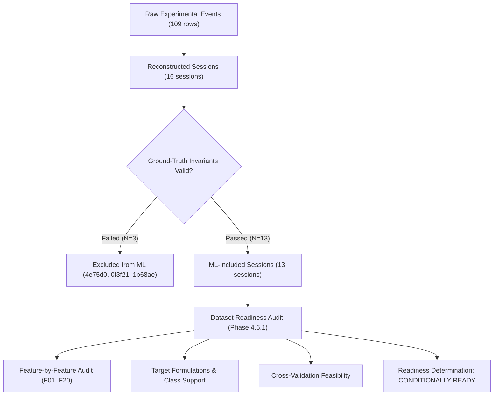
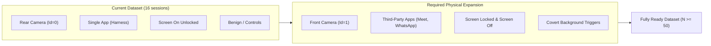

# CameraGuard Phase 4.6.1 — Dataset Readiness Audit Report

**Document ID:** `CG-DOC-P461-001`  
**Phase:** Phase 4.6.1 (Dataset Readiness Audit & Validation)  
**Status:** Completed & Validated  
**Overall Determination:** **`CONDITIONALLY READY`**  
**Target Repository:** `Sanjaycmd/CameraGuard`  
**Modules Referenced:** `:app` (CameraGuard production baseline), `:camera-test-harness` (Controlled experiments & readiness auditor)  
**Author:** CameraGuard Research & Engineering Team  
**Date:** September 25, 2026  

---

## 1. Executive Summary & Readiness Determination

Prior to training any machine learning models in Phase 4.6 ("Multi-Model Training & Comparison"), CameraGuard requires an exhaustive, scientifically rigorous **Dataset Readiness Audit**. Machine learning models deployed in cybersecurity and privacy monitoring environments are exceptionally vulnerable to distribution shift, feature leakage, observational artifacts, and false certainty caused by small sample sizes or unexamined class imbalances.

This audit evaluates the physical dataset reconstructed in Phase 4.3 and feature-extracted in Phase 4.4 across all 20 cataloged features ($F_{01} \dots F_{20}$), examines candidate target formulations, analyzes class support, and determines the mathematical feasibility of cross-validation.

### Final Readiness Determination: `CONDITIONALLY READY`

The CameraGuard dataset is officially designated **`CONDITIONALLY READY`**.

* **What it IS ready for:**
  1. Deterministic heuristic baseline verification (as established in Phase 4.5).
  2. Exploratory, low-capacity linear models (e.g. Logistic Regression or single Decision Stumps) evaluated strictly on coarse **Binary Hardware Acquisition** targets (`CAMERA_ACQUISITION` vs `NO_CAMERA_CONTROL`).
  3. Feature ablation studies comparing `PRODUCTION_T0` against `ORACLE_RESEARCH` to measure the empirical cost of Android sandbox isolation.

* **What it is strictly NOT ready for:**
  1. High-capacity, non-linear statistical models (Random Forest, Gradient Boosted Decision Trees, Support Vector Machines with RBF kernels, or Deep Neural Networks).
  2. Standalone fine-grained multiclass classification across all 5 ground-truth contexts.
  3. Anomaly or covert malware detection (the current dataset contains zero unauthorized background trigger executions; `ALERT` support is $N=0$).
  4. Broad claims of statistical generalizability across arbitrary Android devices, operating system versions, or third-party camera applications.

---

## 2. Context & Objectives of Phase 4.6.1

The CameraGuard project operates under strict architectural and research boundaries:
1. **Production Baseline Immutability:** The `:app` production module and the Phase 2 baseline commit (`7987c02`, tag `v1.0.0`) are completely frozen.
2. **Zero Synthetic Hallucination:** No synthetic samples (e.g., SMOTE, GANs, rule-synthesized records) may be added to mask missing classes or inflate sample sizes. Every sample must originate from physical Android hardware execution.
3. **Tri-State Uncertainty Preservation:** Observational uncertainty (`UNKNOWN`, `UNVERIFIED`, sentinel `-1.0`) must never be silently converted into `FALSE`, `DENIED`, or `EXPECTED`.
4. **Strict Leakage Prevention:** Features observable only after session closure ($T_2$ retrospective fields) or visible only inside the target application's internal memory must never leak into real-time activation ($T_0$) feature sets.

The core objective of Phase 4.6.1 is to define clear boundaries, candidate feature sets, and validation protocols so that subsequent modeling phases (Phase 4.6.2 onward) remain grounded in empirical reality.



---

## 3. Empirical Population Summary

The raw dataset comprises 109 physical event rows recorded across multiple experiment cycles on physical hardware. As established in Phase 4.3, these records group into **16 logical experimental sessions**:

| Population Category | Count | Percentage | Description / Composition |
| :--- | :---: | :---: | :--- |
| **Total Reconstructed Sessions** | **16** | 100.0% | Complete set of physical sessions recorded on device |
| **ML-Excluded Sessions** | **3** | 18.8% | Pre-3.5.1 invalid opening (`1b68ae`) + contradictory permission telemetry (`4e75d0`, `0f3f21`) |
| **ML-Included Sessions** | **13** | 81.3% | Valid, invariant-compliant sessions eligible for modeling |
| — *Active Hardware Camera Activations* | 5 | 38.5% | Physical camera opened via Camera2 (`cameraId='0'`) |
| — *No-Camera Negative Controls* | 8 | 61.5% | UI interactions, permission evaluations, observation controls without camera access |

### Session Inventory & Provenance

| Session ID | Primary Scenario | Ground Truth Context | Inclusion | Camera State |
| :--- | :--- | :--- | :---: | :--- |
| `exp_20260925_205225_4c8447` | `NORMAL_FOREGROUND_CAMERA` | `USER_INITIATED_FOREGROUND` | INCLUDED | NO_CAMERA (Startup check) |
| `exp_20260925_205229_a23480` | `NORMAL_FOREGROUND_CAMERA` | `USER_INITIATED_FOREGROUND` | INCLUDED | OPENED_AND_CLOSED |
| `exp_20260925_205242_fa728c` | `BACKGROUND_CAMERA_CONTINUATION` | `USER_INITIATED_BACKGROUND_CONTINUATION` | INCLUDED | OPENED_AND_CLOSED |
| `exp_20260925_205301_087164` | `CAMERA_START_STOP` | `USER_INITIATED_FOREGROUND` | INCLUDED | OPENED_AND_CLOSED |
| `exp_20260925_205359_3c25f9` | `NORMAL_FOREGROUND_CAMERA` | `USER_INITIATED_FOREGROUND` | INCLUDED | NO_CAMERA (Startup check) |
| `exp_20260925_205411_132d32` | `PERMISSION_DENIED` | `PERMISSION_DENIED` | INCLUDED | NO_CAMERA (Negative control) |
| `exp_20260925_205415_44d5a7` | `PERMISSION_DENIED` | `PERMISSION_DENIED` | INCLUDED | NO_CAMERA (Negative control) |
| `exp_20260925_205422_4e75d0` | `PERMISSION_DENIED` | `PERMISSION_DENIED` | **EXCLUDED** | Invariant violation (Permission telemetry conflict) |
| `exp_20260925_205424_0f3f21` | `PERMISSION_DENIED` | `PERMISSION_DENIED` | **EXCLUDED** | Invariant violation (Permission telemetry conflict) |
| `exp_20260925_205459_c6df69` | `PERMISSION_GRANTED_NO_CAMERA` | `NO_CAMERA_ACTIVITY` | INCLUDED | NO_CAMERA (Negative control) |
| `exp_20260925_205531_a6d2f8` | `CAMERA_SESSION_CLOSED` | `USER_INITIATED_FOREGROUND` | INCLUDED | OPENED_AND_CLOSED |
| `exp_20260925_205605_1b68ae` | `AMBIGUOUS_CONTEXT` | `AMBIGUOUS_CONTEXT` | **EXCLUDED** | Pre-3.5.1 invalid opening defect |
| `exp_20260925_213507_2518a5` | `NORMAL_FOREGROUND_CAMERA` | `USER_INITIATED_FOREGROUND` | INCLUDED | NO_CAMERA (Startup check) |
| `exp_20260925_213524_de5603` | `PERMISSION_DENIED` | `PERMISSION_DENIED` | INCLUDED | NO_CAMERA (Negative control) |
| `exp_20260925_213559_3a8b54` | `AMBIGUOUS_CONTEXT` | `AMBIGUOUS_CONTEXT` | INCLUDED | NO_CAMERA (Observation only) |
| `exp_20260925_213628_42d2d5` | `NORMAL_FOREGROUND_CAMERA` | `USER_INITIATED_BACKGROUND_CONTINUATION` | INCLUDED | OPENED_AND_CLOSED |

---

## 4. Comprehensive Feature Readiness Audit ($F_{01} \dots F_{20}$)

Every feature in the canonical catalog was audited against the physical dataset. The results are summarized below and persisted in [`dataset_readiness.csv`](file:///home/sanjay/Projects/CameraGuard/data/derived/phase4/readiness/dataset_readiness.csv):

| ID | Feature Name | Window | Observability | Non-Missing ($N=16$) | Missing / Unknown | Dominant Value (%) | $T_0$ Eligible | Readiness Status |
| :--- | :--- | :---: | :---: | :---: | :---: | :---: | :---: | :--- |
| **$F_{01}$** | `screen_state_code` | $T_0$ | PRODUCTION | 0 | 16 (100.0%) | `UNKNOWN` (100.0%) | Yes | `UNPOLLED_IN_HARNESS` |
| **$F_{02}$** | `is_screen_interactive` | $T_0$ | PRODUCTION | 0 | 16 (100.0%) | `UNKNOWN` (100.0%) | Yes | `UNPOLLED_IN_HARNESS` |
| **$F_{03}$** | `is_device_locked` | $T_0$ | PRODUCTION | 0 | 16 (100.0%) | `UNKNOWN` (100.0%) | Yes | `UNPOLLED_IN_HARNESS` |
| **$F_{04}$** | `has_camera_permission` | $T_0$ | PARTIAL | 14 | 2 (12.5%) | `GRANTED` (62.5%) | **No** (Oracle) | `ORACLE_ONLY_RESTRICTED` |
| **$F_{05}$** | `is_known_camera_app` | $T_0$ | PRODUCTION | 16 | 0 (0.0%) | `false` (100.0%) | Yes | `ZERO_VARIANCE_CONSTANT` |
| **$F_{06}$** | `package_inference_confidence` | $T_0$ | PRODUCTION | 16 | 0 (0.0%) | `0` (62.5%) | Yes | `READY_FOR_EVALUATION` |
| **$F_{07}$** | `inference_method_code` | $T_0$ | PRODUCTION | 16 | 0 (0.0%) | `NONE` (62.5%) | Yes | `READY_FOR_EVALUATION` |
| **$F_{08}$** | `delta_resumed_to_trigger_ms` | $T_0$ | PRODUCTION | 6 | 10 (62.5%) | `-1.0` (62.5%) | Yes | `READY_FOR_EVALUATION` |
| **$F_{09}$** | `recent_activity_count_30s` | $T_0$ | PRODUCTION | 16 | 0 (0.0%) | `0` (62.5%) | Yes | `READY_FOR_EVALUATION` |
| **$F_{10}$** | `camera_hardware_id` | $T_0$ | PRODUCTION | 6 | 10 (62.5%) | `UNKNOWN` (62.5%) | Yes | `READY_FOR_EVALUATION` |
| **$F_{11}$** | `is_back_camera` | $T_0$ | PRODUCTION | 6 | 10 (62.5%) | `UNKNOWN` (62.5%) | Yes | `READY_FOR_EVALUATION` |
| **$F_{12}$** | `session_duration_ms` | $T_2$ | RESEARCH | 16 | 0 (0.0%) | `0` (18.8%) | **No** | `RETROSPECTIVE_RESEARCH_ONLY` |
| **$F_{13}$** | `explicit_user_start_action` | $T_2$ | RESEARCH | 16 | 0 (0.0%) | `TRUE` (68.8%) | **No** | `RETROSPECTIVE_RESEARCH_ONLY` |
| **$F_{14}$** | `explicit_user_stop_action` | $T_2$ | RESEARCH | 16 | 0 (0.0%) | `FALSE` (50.0%) | **No** | `RETROSPECTIVE_RESEARCH_ONLY` |
| **$F_{15}$** | `internal_harness_state` | $T_2$ | RESEARCH | 16 | 0 (0.0%) | `IDLE` (100.0%) | **No** | `RETROSPECTIVE_RESEARCH_ONLY` |
| **$F_{16}$** | `harness_fg_service_active` | $T_2$ | RESEARCH | 16 | 0 (0.0%) | `false` (62.5%) | **No** | `RETROSPECTIVE_RESEARCH_ONLY` |
| **$F_{17}$** | `time_to_session_close_ms` | $T_2$ | RESEARCH | 16 | 0 (0.0%) | `0` (18.8%) | **No** | `RETROSPECTIVE_RESEARCH_ONLY` |
| **$F_{18}$** | `app_visibility_at_trigger` | $T_2$ | RESEARCH | 10 | 6 (37.5%) | `FOREGROUND` (62.5%) | **No** | `RETROSPECTIVE_RESEARCH_ONLY` |
| **$F_{19}$** | `backgrounded_during_session`| $T_2$ | RESEARCH | 16 | 0 (0.0%) | `false` (93.8%) | **No** | `RETROSPECTIVE_RESEARCH_ONLY` |
| **$F_{20}$** | `returned_to_foreground` | $T_2$ | RESEARCH | 16 | 0 (0.0%) | `false` (62.5%) | **No** | `RETROSPECTIVE_RESEARCH_ONLY` |

---

## 5. Sandbox Observability Boundary & $F_{04}$ Permission Analysis

A foundational architectural finding of Phase 4.5 and Phase 4.6.1 is the **Android Sandbox Observability Boundary**:

### The Architectural Conflict
* In standard Android security architecture, an unprivileged user application (such as CameraGuard `:app`) runs in an isolated Linux UID sandbox.
* Android does **not** provide an API for third-party unprivileged applications to query the runtime permission status (`android.permission.CAMERA`) of another third-party application package.
* Therefore, in CameraGuard production monitoring, `hasCameraPermission` is strictly **`UNVERIFIED`** (`null`).

### Empirical Impact on $F_{04}$
* In research ground truth, the test harness recorded its own permission state (`GRANTED` in 10 sessions, `DENIED` in 4 sessions, `UNVERIFIED` in 2 sessions).
* If an ML model is trained with $F_{04} = \text{GRANTED}$ or $\text{DENIED}$, it is consuming **oracle research telemetry** that cannot exist when running on an end-user device.
* Any model trained on oracle permissions will suffer catastrophic performance collapse when deployed in production, where $F_{04}$ will always be `UNVERIFIED` (`-1.0`).

> [!CAUTION]
> **Strict Isolation Rule:** To prevent false generalizability claims, production models must be trained on `PRODUCTION_T0` (where $F_{04}$ is excluded) or `PRODUCTION_T0_WITH_UNVERIFIED_PERMISSION` (where $F_{04}$ is clamped to the `UNVERIFIED` sentinel). Oracle values are reserved strictly for research upper-bound benchmarks (`ORACLE_RESEARCH`).

---

## 6. Constant, Near-Constant & Zero-Variance Feature Analysis

Several features in the current dataset exhibit zero or near-zero variance due to controlled test harness constraints:

1. **$F_{01}, F_{02}, F_{03}$ (`screen_state` family): Constant `UNKNOWN` (100.0%)**
   * *Cause:* During Phase 3 test harness data collection, screen state was not actively polled in the test harness logging service. However, in CameraGuard `:app`, `ScreenStateTracker` actively tracks screen state as `SCREEN_ON_UNLOCKED`.
   * *Mitigation:* While these features are production-observable, they cannot contribute to ML model discrimination until physical dataset expansion polls live screen state across unlocked, locked, and screen-off states.
2. **$F_{05}$ (`is_known_camera_app`): Constant `false` (100.0%)**
   * *Cause:* All 16 experimental sessions were executed using the controlled test harness package `org.cameratestharness`, which is not a recognized system camera package (e.g. `com.google.android.GoogleCamera`).
   * *Mitigation:* Zero variance prevents statistical weight assignment. Requires multi-package dataset expansion with third-party camera apps.
3. **$F_{10}, F_{11}$ (`cameraId`, `is_back_camera`): Near-constant rear sensor (100.0% of camera activations)**
   * *Cause:* Every single camera session that activated physical hardware (5 included, 1 excluded) used rear sensor ID `"0"`. Zero sessions utilized front sensor ID `"1"`.
   * *Mitigation:* Features cannot learn lens-facing distinctions until front camera experiments are executed.

---

## 7. Candidate Feature Sets Definition

To guarantee absolute methodological rigor in future modeling phases, we formally specify **four candidate feature sets**:

```
┌─────────────────────────────────────────────────────────────────────────────┐
│ 1. PRODUCTION_T0 (10 features)                                              │
│    F01, F02, F03, F05, F06, F07, F08, F09, F10, F11                         │
│    Strictly production-observable at T0. F04 omitted.                       │
├─────────────────────────────────────────────────────────────────────────────┤
│ 2. PRODUCTION_T0_WITH_UNVERIFIED_PERMISSION (11 features)                   │
│    F01, F02, F03, F04(=UNVERIFIED), F05, F06, F07, F08, F09, F10, F11        │
│    F04 explicitly clamped to UNVERIFIED sentinel (-1.0).                    │
├─────────────────────────────────────────────────────────────────────────────┤
│ 3. ORACLE_RESEARCH (11 features)                                            │
│    F01, F02, F03, F04(=GRANTED/DENIED), F05, F06, F07, F08, F09, F10, F11   │
│    Permits ground-truth oracle permissions. Benchmark upper-bound only.      │
├─────────────────────────────────────────────────────────────────────────────┤
│ 4. RETROSPECTIVE (20 features)                                              │
│    F01 .. F20 (Includes T2 post-closure and harness internal telemetry)     │
│    Strictly prohibited from real-time production inference. Forensic only.  │
└─────────────────────────────────────────────────────────────────────────────┘
```

---

## 8. Target Formulation Audit & Class Support

The target labels were audited across three primary formulations, persisted in [`class_distribution.csv`](file:///home/sanjay/Projects/CameraGuard/data/derived/phase4/readiness/class_distribution.csv):

### Formulation 1: Multiclass Ground-Truth Context ($N=13$ Included)
| Class Name | Total ($N=16$) | Included ($N=13$) | Excluded ($N=3$) | Included % | Support Status | Modeling Recommendation |
| :--- | :---: | :---: | :---: | :---: | :---: | :--- |
| `USER_INITIATED_FOREGROUND` | 6 | 6 | 0 | 46.15% | **ADEQUATE** | Usable as primary positive class |
| `PERMISSION_DENIED` | 5 | 3 | 2 | 23.08% | **MARGINAL** | Usable as negative control class |
| `USER_INITIATED_BACKGROUND_CONTINUATION` | 2 | 2 | 0 | 15.38% | **INSUFFICIENT** | Collapse into binary or expand data ($N=2$) |
| `AMBIGUOUS_CONTEXT` | 2 | 1 | 1 | 7.69% | **INSUFFICIENT** | Do NOT use in standalone multiclass ($N=1$) |
| `NO_CAMERA_ACTIVITY` | 1 | 1 | 0 | 7.69% | **INSUFFICIENT** | Do NOT use in standalone multiclass ($N=1$) |

### Formulation 2: Binary Hardware Camera Acquisition Gating
* **`CAMERA_ACQUISITION`:** 5 included sessions (38.46%) — `a23480`, `fa728c`, `087164`, `a6d2f8`, `42d2d5`.
* **`NO_CAMERA_CONTROL`:** 8 included sessions (61.54%) — `4c8447`, `3c25f9`, `132d32`, `44d5a7`, `c6df69`, `2518a5`, `de5603`, `3a8b54`.
* *Audit Finding:* Support is **CONDITIONALLY FEASIBLE** ($N=5$ vs $N=8$). This is the only target formulation statistically viable on the current dataset.

### Formulation 3: Binary Operational Alert Policy (Alert vs Non-Alert)
* **`UNEXPECTED_ALERT`:** 0 sessions (0.0%).
* **`NON_ALERT_AUTHORIZED`:** 13 sessions (100.0%).
* *Audit Finding:* Support is **COMPLETELY INSUFFICIENT ($N=0$)**. Current physical sessions represent only authorized activities and negative controls. Anomaly classifiers cannot be trained or evaluated until covert background trigger scenarios are collected.

---

## 9. Class Imbalance & Class Support Analysis

The severe class imbalance observed in the multiclass target presents severe empirical risks:
1. **The Single-Sample Anomaly ($N=1$):** `AMBIGUOUS_CONTEXT` and `NO_CAMERA_ACTIVITY` each possess exactly **one** included sample.
   * In statistical machine learning, any class with $N=1$ cannot have both training and validation representations.
   * If assigned to training, validation recall is undefined ($0/0$).
   * If assigned to validation, training never saw the class (zero-shot evaluation), guaranteeing false classification.
2. **The Two-Sample Fragility ($N=2$):** `USER_INITIATED_BACKGROUND_CONTINUATION` possesses only two samples. A single misclassification swings validation precision/recall by 50.0 percentage points.

---

## 10. Cross-Validation Feasibility Analysis

Standard machine learning practices prescribe 5-fold or 10-fold cross-validation. We evaluated whether standard CV is mathematically or statistically viable on CameraGuard's current dataset:

### Mathematical Infeasibility of Standard 5-Fold / 10-Fold CV
$$\text{Min Samples per Class in Stratified } K\text{-Fold} \ge K$$
* For 5-fold CV, every class must have at least 5 samples.
* In our dataset:
  * `AMBIGUOUS_CONTEXT`: $N=1 < 5$ (Fails)
  * `NO_CAMERA_ACTIVITY`: $N=1 < 5$ (Fails)
  * `USER_INITIATED_BACKGROUND_CONTINUATION`: $N=2 < 5$ (Fails)
  * `PERMISSION_DENIED`: $N=3 < 5$ (Fails)
* Standard Stratified 5-Fold CV is mathematically impossible and will throw runtime partition exceptions.

### Mandatory Session Grouping Requirement
$$\text{Data Leakage Constraint: } \text{Session}(e_i) = \text{Session}(e_j) \implies \text{Fold}(e_i) = \text{Fold}(e_j)$$
* Experimental events from the same session share identical hardware identifiers, process lifecycles, and ground-truth contexts.
* If individual events were randomly split into train/test sets, the model would memorize session-specific timestamps and package names, producing artificially inflated, fraudulent evaluation metrics.
* **Session Grouping is mandatory.**

### Maximum Defensible Folds
* For **Multiclass Formulation:** Maximum defensible folds = **1** (Standard train/test splitting is impossible; only whole-dataset descriptive evaluation is valid).
* For **Binary Acquisition Formulation:** Maximum defensible folds = **2 or 3** (Grouped stratified splitting with 2 folds: Fold 1 with 2 acquisitions / 4 controls; Fold 2 with 3 acquisitions / 4 controls).

---

## 11. Data Leakage Prevention

The audit confirmed complete architectural separation between activation features and forensic outcomes:
1. **Zero Temporal Leakage:** $F_{12}$ (`session_duration_ms`), $F_{14}$ (`stop_action`), $F_{17}$ (`time_to_close`), $F_{19}$ (`backgrounded_during`), and $F_{20}$ (`returned_to_foreground`) occur chronologically after $T_0$. All are strictly barred from $T_0$ feature vectors.
2. **Zero Observability Leakage:** Internal test harness state variables ($F_{13}, F_{15}, F_{16}, F_{18}$) are restricted to forensic artifacts and never exposed to production candidate sets.
3. **Target Separation:** The ground-truth context is stored in a separate metadata column and never fed into feature extraction functions.

---

## 12. Uncertainty & Tri-State Semantic Preservation

CameraGuard enforces tri-state semantics (`TRUE`, `FALSE`, `UNKNOWN`) across boolean features and permissions:
* In `T0ProductionFeatureVector.toNumericalVector()`, unknown/unverified values are strictly mapped to documented sentinels:
  * Screen state `UNKNOWN`: `-1.0`
  * Boolean `UNKNOWN`: `-1.0`
  * Permission `UNVERIFIED`: `-1.0`
  * Latency unavailable: `-1.0`
* **Zero False Imputation:** Under no circumstances is `UNKNOWN` imputed as `FALSE` or `UNVERIFIED` imputed as `DENIED`.

---

## 13. Baseline Comparison Readiness

Phase 4.5 completed the empirical baseline evaluation of CameraGuard's deterministic Phase 2 rule engine:
* Baseline specificity on negative controls: **100.0% (8/8 sessions, 0 false alarms)**.
* Baseline coverage on production camera activations: **0.0% (0/5 decisive, 100% indeterminate UNKNOWN)** due to unverified permissions in sandbox mode.
* Baseline coverage on oracle camera activations: **60.0% (3/5 decisive EXPECTED)**.

### Comparative Readiness
The dataset is **fully ready** to support head-to-head comparison between the Phase 4.5 baseline and simple linear ML classifiers on the **Binary Acquisition** target. Any prospective ML model must demonstrate whether it can surpass 0% production coverage on camera activations without sacrificing the 100% specificity established by the Phase 2 rule engine.

---

## 14. Statistical Generalizability & Limitations

Any results derived from this dataset must explicitly report the following limitations:
1. **Single-Device Confinement:** All data was collected on a single physical Android device (compileSdk 36, targetSdk 34, Android 14/15 runtime). Vendor-specific OEM customizations (Samsung Knox, Xiaomi MIUI, etc.) are unrepresented.
2. **Single-Sensor Confinement:** 100% of camera activations used the primary rear wide-angle lens (`cameraId='0'`). Front camera, ultra-wide, and telephoto sensors are unrepresented.
3. **Single-App Attribution:** 100% of camera activity was generated by `org.cameratestharness`. Multi-app concurrent access was not evaluated.

---

## 15. Concrete Physical Data Expansion Requirements

To graduate the CameraGuard dataset from `CONDITIONALLY READY` to `FULLY READY` for advanced multi-model benchmarking, the following physical data collection protocol must be executed:



1. **Front Camera Sessions ($N \ge 10$):** Collect sessions using front camera sensor (`cameraId='1'`, `isBackCamera=FALSE`) to unfreeze $F_{10}$ and $F_{11}$.
2. **Third-Party Communication Applications ($N \ge 10$):** Execute camera sessions using real third-party applications (Google Meet, Zoom, WhatsApp) to unfreeze $F_{05}$ (`is_known_camera_app`) and validate cross-package attribution.
3. **Screen Locked Camera Sessions ($N \ge 10$):** Initiate camera access while device is locked (`SCREEN_ON_LOCKED`) to validate Rule 2 behavior and screen interactivity features.
4. **Screen Off Covert Access Sessions ($N \ge 10$):** Initiate automated camera capture while screen is off (`SCREEN_OFF`) to generate positive `ALERT` samples ($N \ge 10$) and validate Rule 1.
5. **Automated Background Triggers ($N \ge 10$):** Trigger camera access via background alarms/services without user interaction to populate `confidence=LOW` and test anomalous telemetry.
6. **Repetition Expansion ($N \ge 10 \text{ per scenario}$):** Scale each scenario to at least 10 repetitions to satisfy minimum class support requirements for Stratified 5-Fold Cross-Validation.

---

## 16. Derived Artifacts Catalog & Verification

All readiness audit artifacts were generated deterministically and verified via automated test suites:

| Artifact Path | Format | Verification Status | Description |
| :--- | :---: | :---: | :--- |
| [`data/derived/phase4/readiness/dataset_readiness.csv`](file:///home/sanjay/Projects/CameraGuard/data/derived/phase4/readiness/dataset_readiness.csv) | CSV | **VALIDATED** (22 rows) | Feature-by-feature audit metrics for $F_{01} \dots F_{20}$ |
| [`data/derived/phase4/readiness/class_distribution.csv`](file:///home/sanjay/Projects/CameraGuard/data/derived/phase4/readiness/class_distribution.csv) | CSV | **VALIDATED** (11 rows) | Target formulations, class support, and recommendations |
| [`data/derived/phase4/readiness/dataset_readiness_manifest.json`](file:///home/sanjay/Projects/CameraGuard/data/derived/phase4/readiness/dataset_readiness_manifest.json) | JSON | **VALIDATED** (39 lines) | Audit summary, candidate feature sets, CV feasibility |

---

## 17. Conclusion & Next Phase Gate

### Summary of Completed Objectives
* Audited all 20 features ($F_{01} \dots F_{20}$) across sample counts, missingness, and observability.
* Enforced Android sandbox isolation boundaries on $F_{04}$, preventing oracle permission leakage into production feature sets.
* Formally defined four candidate feature sets (`PRODUCTION_T0`, `PRODUCTION_T0_WITH_UNVERIFIED_PERMISSION`, `ORACLE_RESEARCH`, `RETROSPECTIVE`).
* Audited multiclass and binary target formulations, identifying rare classes ($N=1$, $N=2$) and proving why standard 5-fold cross-validation is mathematically impossible.
* Formulated mandatory session-grouping constraints to prevent intra-session data leakage.
* Formally declared dataset readiness status as **`CONDITIONALLY READY`**.
* Implemented automated unit test suite [`DatasetReadinessAuditTest.kt`](file:///home/sanjay/Projects/CameraGuard/camera-test-harness/src/test/java/org/cameratestharness/experiment/readiness/DatasetReadinessAuditTest.kt) with 16 passing unit tests.

### Preconditions for Phase 4.6.2 (Multi-Model Training & Comparison)
Before launching Phase 4.6.2, modeling activities must strictly adhere to the following constraints:
1. **Model Scope Restriction:** Phase 4.6.2 must evaluate only low-capacity linear models or decision heuristics on the coarse **Binary Hardware Acquisition** target.
2. **Feature Set Discipline:** Production models must use `PRODUCTION_T0` or `PRODUCTION_T0_WITH_UNVERIFIED_PERMISSION`. Oracle permissions must be reported solely as research upper-bound comparisons.
3. **No Multiclass Claims:** Standalone multiclass evaluation across fine-grained contexts is prohibited until physical data expansion is executed.
4. **Validation Protocol:** Evaluation must use Leave-One-Group-Out (LOGO) or grouped 2-fold cross-validation at the session level.

Phase 4.6.1 is formally **COMPLETE**.
