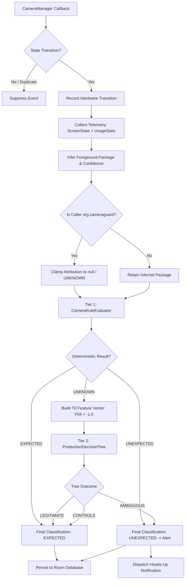

# CameraGuard — Phase 7.7: Final Algorithm & Decision Flow Documentation

## 1. Algorithmic Overview

CameraGuard's core pipeline consists of four sequential stages:
1. **Hardware Acquisition Detection & Deduplication**
2. **Session Context Correlation & Attribution**
3. **Production Feature Vector Construction ($T_0$)**
4. **Two-Tier Hybrid Classification & Policy Resolution**



---

## 2. Stage 1: Hardware Detection & Deduplication Algorithm

Let $S(c)$ denote the cached state of camera sensor $c \in \mathcal{C}$, and let $E_{in}(c, s)$ denote an incoming callback event with reported state $s \in \{\text{AVAILABLE}, \text{UNAVAILABLE}\}$.

```
Algorithm 1: Camera Availability Update & Deduplication
Input: cameraId c, incoming state s, current time t
Output: Processed transition or suppression

1. previousState ← StateMap.get(c)
2. StateMap.put(c, s)
3. if previousState == null then
4.     // Establish initial baseline without event generation
5.     return SUPPRESSED_BASELINE
6. end if
7. if previousState == s then
8.     // Duplicate callback reporting unchanged hardware state
9.     return SUPPRESSED_DUPLICATE
10. end if
11. // Genuine state transition observed: trigger correlation pipeline
12. return handleCameraTransition(c, s, t)
```

---

## 3. Stage 2: Context Correlation & Attribution Algorithm

Let $T_{event}$ denote the timestamp of the hardware transition. Let $\mathcal{U}$ be the set of `ACTIVITY_RESUMED` events retrieved from `UsageStatsManager` in window $[T_{event} - 30000\text{ ms}, T_{event}]$.

```
Algorithm 2: Foreground Package Attribution
Input: transition timestamp t, own package name P_guard
Output: InferredPackageContext (pkg, confidence, method, deltaMs)

1. candidates ← { u ∈ U | u.type == ACTIVITY_RESUMED }
2. if candidates is empty then
3.     return (pkg: null, confidence: NONE, method: NONE)
4. end if
5. newest ← argmin_{u ∈ candidates} (t - u.timestamp)
6. delta ← t - newest.timestamp
7.
8. // Case A: CameraGuard is top resumed app
9. if newest.packageName == P_guard then
10.    // Check for recent camera-capable transition within lookback window (5000ms)
11.    recent_transition ← findCandidate(candidates, delta <= 5000ms, hasCameraPerm = true, pkg != P_guard)
12.    if recent_transition != null then
13.        confidence ← computeConfidence(t - recent_transition.timestamp)
14.        return (pkg: recent_transition.pkg, confidence, USAGE_STATS_ACTIVITY_RESUMED, delta)
15.    else
16.        // Strict Anti-Self-Attribution Invariant: never attribute to self
17.        return (pkg: null, confidence: NONE, method: NONE)
18.    end if
19. end if
20.
21. // Case B: External app is top resumed app
22. confidence ← computeConfidence(delta)
23. return (pkg: newest.packageName, confidence, USAGE_STATS_ACTIVITY_RESUMED, delta)
```

### Confidence Thresholds:
$$\text{Confidence}(\Delta) = \begin{cases}
\text{HIGH} & \text{if } \Delta \le 500\text{ ms} \\
\text{MEDIUM} & \text{if } 500\text{ ms} < \Delta \le 2000\text{ ms} \\
\text{LOW} & \text{if } 2000\text{ ms} < \Delta \le 30000\text{ ms} \\
\text{NONE} & \text{if candidate is null}
\end{cases}$$

---

## 4. Stage 3: Production Feature Vector Construction ($T_0$)

Production inference extracts 11 real-time observable telemetry features ($F_{01}$–$F_{11}$). Retrospective features ($F_{12}$–$F_{20}$) are strictly excluded.

| Feature | Name | Definition & Clamping |
|---|---|---|
| $F_{01}$ | `f01_screen_state` | $0.0$ (OFF), $1.0$ (UNLOCKED), $2.0$ (LOCKED), $-1.0$ (UNKNOWN) |
| $F_{02}$ | `f02_is_interactive` | $1.0$ if screen is on (locked or unlocked), else $0.0$ |
| $F_{03}$ | `f03_is_locked` | $1.0$ if screen is locked, else $0.0$ |
| $F_{04}$ | `f04_perm_clamped` | **Strictly $-1.0$ (`UNVERIFIED`)** in production sandbox |
| $F_{05}$ | `f05_known_camera_app`| $1.0$ if package is in known camera whitelist, else $0.0$ |
| $F_{06}$ | `f06_package_confidence`| $0.0$ (NONE), $1.0$ (LOW), $2.0$ (MEDIUM), $3.0$ (HIGH) |
| $F_{07}$ | `f07_inference_method` | $0.0$ (NONE), $1.0$ (USAGE_STATS), $3.0$ (ACCESSIBILITY), $-1.0$ (SYNTHETIC) |
| $F_{08}$ | `f08_delta_resumed_ms` | Elapsed time from last resumed event ($\text{ms}$), or $-1.0$ if none |
| $F_{09}$ | `f09_recent_activity_count` | Count of `ACTIVITY_RESUMED` events in preceding 30s |
| $F_{10}$ | `f10_camera_id` | $0.0$ (Back/Camera 0), $1.0$ (Front/Camera 1), else $-1.0$ |
| $F_{11}$ | `f11_is_back_camera` | $1.0$ if rear facing, $0.0$ if front facing, else $-1.0$ |

---

## 5. Stage 4: Two-Tier Hybrid Classification Algorithm

```
Algorithm 3: Two-Tier Hybrid Evaluation
Input: rawEvent, screenState, inferredContext, cameraId
Output: HybridEvaluationResult (finalClassification, tierUsed, explanation)

1. // Tier 1: Evaluate Deterministic Security Rules
2. tier1Result ← CameraRuleEvaluator.evaluate(rawEvent, screenState, inferredContext)
3. if tier1Result.classification != UNKNOWN then
4.     return HybridEvaluationResult(
5.         finalClassification: tier1Result.classification,
6.         tierUsed: "TIER_1_RULE",
7.         explanation: tier1Result.explanation,
8.         mlInvoked: false
9.     )
10. end if
11.
12. // Tier 2: Evaluate Native Decision Tree
13. features ← buildProductionFeatureVector(rawEvent, screenState, inferredContext, cameraId)
14. treeResult ← ProductionDecisionTree.evaluate(features)
15.
16. match treeResult with
17.     case AMBIGUOUS  => finalClass ← UNEXPECTED
18.     case LEGITIMATE => finalClass ← EXPECTED
19.     case CONTROLS   => finalClass ← EXPECTED
20.
21. return HybridEvaluationResult(
22.     finalClassification: finalClass,
23.     tierUsed: "TIER_2_ML",
24.     explanation: "Hybrid ML Tier-2 classified event as " + treeResult.name,
25.     mlInvoked: true
26. )
```

### Production Decision Tree Logic ($depth \le 5$):
```
F06 <= 1.50 (Package confidence is LOW or NONE)
|--- F07 <= 1.00 (Inference method is USAGE_STATS or NONE)
|    |--- F09 <= 1.00 (Activity count <= 1: idle screen)
|    |    `--> CONTROLS (Final: EXPECTED)
|    `--- F09 > 1.00 (Activity count > 1: active app switching)
|         `--> AMBIGUOUS (Final: UNEXPECTED)
|--- F07 > 1.00
|    |--- F09 <= 1.50
|    |    |--- F08 <= 59.5 ms
|    |    |    `--> AMBIGUOUS (Final: UNEXPECTED)
|    |    `--- F08 > 59.5 ms
|    |         `--> LEGITIMATE (Final: EXPECTED)
|    `--- F09 > 1.50
|         `--> AMBIGUOUS (Final: UNEXPECTED)
F06 > 1.50 (Package confidence is MEDIUM or HIGH)
`--> LEGITIMATE (Final: EXPECTED)
```

---

## 6. Documented Research Limitations

1. **L1 — UsageStats Lookback Sensitivity**: When an application's user-facing `ACTIVITY_RESUMED` event is older than 30 seconds (due to UI navigation idle time before camera opening), attribution falls back to honest `UNKNOWN` (observed in C1). Hardware detection remains 100% intact.
2. **L2 — Background Streaming Over-Alerting**: When a legitimate foreground camera application moves to the background while holding the camera open, package confidence degrades to LOW ($F_{06} \le 1.50$), causing the Decision Tree to classify the ongoing session as `AMBIGUOUS` $\to$ `UNEXPECTED` (observed in C6; conservative security stance).
3. **L3 — Rapid Multi-Caller State Handoffs**: `CameraAvailabilityTracker` relies on state-based deduplication (`AVAILABLE` $\to$ `UNAVAILABLE`). If an external camera caller hands off to another without an intermediate `AVAILABLE` callback, rapid handoffs can be coalesced (observed in C9).
4. **L4 — Idle Screen Unattributed Capture**: When an unprivileged background component captures camera on an idle screen ($F_{09} \le 1.0$), the Decision Tree routes to `CONTROLS` $\to$ `EXPECTED`. When recent app switching has occurred ($F_{09} > 1.0$), it escalates to `AMBIGUOUS` $\to$ `UNEXPECTED`.
