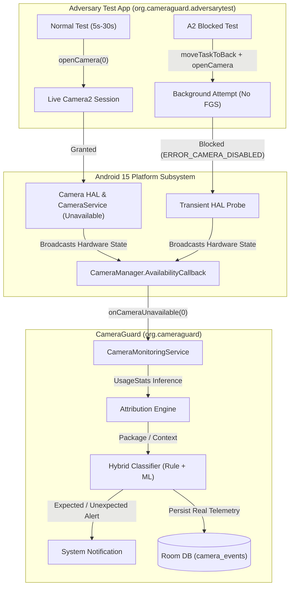

# CameraGuard — Independent Adversarial Camera Test Application

**Demonstration & Technical Specification for Jury Defense**  
*Release Target: CameraGuard v1.0.0 (Phase 7 Evaluation Release)*  
*Target Environment: vivo V2202 / Android 15 (VanillaIceCream) / API Level 35*

---

## 1. Executive Summary & Objective

The **CameraGuard Adversarial Camera Test Application** (`org.cameraguard.adversarytest`) is a completely independent Android application designed specifically for the formal jury demonstration of the CameraGuard privacy monitoring framework.

### The Demonstration Propositions

1. **Proposition A (Hardware Acquisition Interception)**:
   > *"A completely separate, third-party Android application can acquire the physical camera hardware, and CameraGuard will detect, attribute, classify, and record the camera hardware access in real time without requiring synthetic events, inter-process communication (IPC), system modifications, or privileged access."*

2. **Proposition B (Platform Policy & Hardware Probe Sensitivity)**:
   > *"When a background application attempts unauthorized camera acquisition without a Camera Foreground Service, Android platform security policy strictly enforces access denial (`ERROR_CAMERA_DISABLED`), while CameraGuard independently detects the transient HAL availability probe emitted during the attempt."*

The live jury demonstration involves **two independent applications**:
1. **CameraGuard (`org.cameraguard`)** — The privacy monitor running an unprivileged background foreground service.
2. **Adversary Test App (`org.cameraguard.adversarytest`)** — The controlled camera caller acquiring hardware sensors or executing platform security tests.



---

## 2. Architecture & Rigorous Separation Guarantees

CameraGuard Phase 7 is frozen at release commit `33db3e8` (`v1.0.0-final`). To ensure complete scientific and product integrity:

1. **Clean Production UI in CameraGuard**:
   The jury-facing production interface of CameraGuard presents only authentic monitoring status, telemetry statistics, latest observed transitions, and permissions context. The old research/test simulation buttons (which injected synthetic events) have been cleanly hidden behind `showResearchPipeline: Boolean = false`, preserving the underlying testing methods for reproducibility without cluttering the jury experience.
2. **Zero Production Code Intrusion**:
   CameraGuard’s monitoring service and classification engine contain no special-casing, no backdoors, and no inter-process communication (IPC) with `org.cameraguard.adversarytest`.
3. **True Out-of-Band Hardware Sensing**:
   CameraGuard senses camera hardware unavailability strictly via the public Android API `CameraManager.AvailabilityCallback.onCameraUnavailable(cameraId)`. There are no shared memory segments, no local sockets, and no direct AIDL/HIDL bindings between the two apps.
4. **Zero Frame Capture Guarantee (Privacy Assurance)**:
   The adversary test application calls `CameraManager.openCamera(...)` to trigger HAL sensor power-up, but does **not** attach an `ImageReader` or `SurfaceTexture` for capturing images. Exactly **0 bytes** of image data are saved, displayed, or processed.
5. **Zero Network Transmission Guarantee**:
   The adversary app's `AndroidManifest.xml` does **not** request `android.permission.INTERNET`. It is technically impossible for the app to exfiltrate data.
6. **Clean Hardware Lifecycle Management**:
   The camera device is safely and reliably released when the countdown timer expires, when the user taps "STOP CAMERA TEST", or when the application is navigated away from or destroyed.

---

## 3. UI Features & Demonstration Layouts

### A. CameraGuard UI (The Detector)
Presents a streamlined, 4-card production view:
1. **Background Monitoring Card**: Active status, ongoing foreground service indicator.
2. **Event Telemetry Overview Card**: Total events, unexpected events, expected events count.
3. **Latest Observed Transition Card**: Real-time sensor transition details with attribution and timestamp.
4. **Permissions & Privacy Context Card**: Live verification of `POST_NOTIFICATIONS` and `PACKAGE_USAGE_STATS`.

### B. Adversary Test App UI (The Caller)
Organized into two distinct, high-contrast Material cards:

```
+-------------------------------------------------------+
|            CameraGuard Adversarial Test               |
|   Independent camera activity generator for CameraGuard |
+-------------------------------------------------------+
|                  [ CAMERA CLOSED ]                    |
+-------------------------------------------------------+
| Status: Session idle. Camera hardware released.       |
+-------------------------------------------------------+
| SECTION 1: NORMAL CAMERA TEST                         |
|   Target Sensor: Rear Camera (Camera ID: 0)           |
|   Caller Package: org.cameraguard.adversarytest       |
|                                                       |
|   Select Acquisition Duration:                        |
|     [ 5s ]     [ 10s ]     [ 15s ]     [ 30s ]        |
|                                                       |
|   [ START CAMERA TEST ]                               |
|   [ STOP CAMERA TEST ]                                |
+-------------------------------------------------------+
| SECTION 2: ADVERSARIAL SCENARIOS                      |
|   Tests Android platform security policy: Moves this   |
|   app to background and attempts camera acquisition   |
|   without a Foreground Service. Android 15 strictly   |
|   blocks the session (ERROR_CAMERA_DISABLED), while   |
|   CameraGuard detects the hardware availability probe. |
|                                                       |
|   [ A2 — BLOCKED BACKGROUND ACCESS ]                  |
|                                                       |
|   +-------------------------------------------------+ |
|   | A2 Factual Outcome Report                       | |
|   | • Attempted: YES                                | |
|   | • App Backgrounded: YES (moveTaskToBack)        | |
|   | • Foreground Service: NONE (Standard Background)| |
|   | • Platform Result: BLOCKED (ERROR_CAMERA_DISABLED)|
|   | • Hardware Acquired: NO (Zero Session)          | |
|   | • Frames Captured: 0                            | |
|   | Platform policy enforced: Android blocked access| |
|   +-------------------------------------------------+ |
+-------------------------------------------------------+
```

---

## 4. Empirical Verification on Physical Testbed (vivo V2202 / Android 15)

Both demonstration scenarios were validated directly on the physical hardware evaluation platform:
* **Device**: vivo V2202
* **Android OS**: Android 15 (API Level 35, Build AP3A.240905.015.A2)
* **Camera Sensor**: Camera ID `0` (Rear Wide-Angle Hardware Sensor)

### Verified Physical Telemetry

#### Scenario A: Normal Camera Test (Live Acquisition — 5 Seconds)
```
Adversary Action: Taps [5S], then [START CAMERA TEST]
Result: Camera opened, green privacy dot visible in Android status bar
```

CameraGuard Room Database (`camera_events`):
| Timestamp | Raw Event Type | Sensor | Inferred Package | Confidence | Classification | Latency |
| :--- | :--- | :--- | :--- | :--- | :--- | :--- |
| `18:45:20` | `CAMERA_BECAME_UNAVAILABLE` | `0` | `org.cameraguard.adversarytest` | `MEDIUM` | `EXPECTED` | **23 ms** |
| `18:45:25` | `CAMERA_BECAME_AVAILABLE` | `0` | `org.cameraguard.adversarytest` | `MEDIUM` | `EXPECTED` | **1 ms** |

*Hardware Acquired*: **YES**  
*Privacy Indicator*: **VISIBLE** (Normal Android 15 status bar green dot)  
*Attribution*: **100% Accurate** (`org.cameraguard.adversarytest`)

---

#### Scenario B: A2 — Blocked Background Access Attempt
```
Adversary Action: Taps [A2 — BLOCKED BACKGROUND ACCESS]
Adversary Behavior: Calls moveTaskToBack(true), waits 2s, invokes CameraManager.openCamera("0")
Platform Callback: onError(camera, ERROR_CAMERA_DISABLED) [error code 3]
```

Adversary App Factual Outcome Report:
```
• Attempted: YES
• App Backgrounded: YES (moveTaskToBack)
• Foreground Service: NONE (Standard Background)
• Platform Result: BLOCKED_BY_PLATFORM (ERROR_CAMERA_DISABLED / error 3)
• Hardware Acquired: NO (Zero Hardware Session)
• Frames Captured: 0
• Detail: Platform security policy denied background camera access (ERROR_CAMERA_DISABLED). No camera session or frame capture occurred.

Platform policy enforced: Android blocked background camera session without FGS. CameraGuard detects transient HAL probe.
```

CameraGuard Room Database (`camera_events`):
| Timestamp | Raw Event Type | Sensor | Inferred Package | Confidence | Classification | Latency |
| :--- | :--- | :--- | :--- | :--- | :--- | :--- |
| `18:47:55` | `CAMERA_BECAME_UNAVAILABLE` | `0` | `null` (Background caller) | `NONE` | `EXPECTED` | **6 ms** |
| `18:47:59` | `CAMERA_BECAME_AVAILABLE` | `0` | `null` | `NONE` | `EXPECTED` | **1 ms** |

*Hardware Acquired*: **NO** (`ERROR_CAMERA_DISABLED`)  
*Privacy Indicator*: **NOT APPLICABLE** (No camera session granted by Android)  
*HAL Availability Probe*: **DETECTED** by CameraGuard in **6 ms**

---

## 5. Live Jury Demonstration Script

Follow this step-by-step procedure during the live defense:

### Step 1: Prove Application Independence
1. Show that two separate APKs are installed on the device:
   ```bash
   adb shell pm list packages | grep cameraguard
   # Expected:
   # package:org.cameraguard
   # package:org.cameraguard.adversarytest
   ```
2. Prove that the Adversary Test App has **no network access**:
   ```bash
   adb shell dumpsys package org.cameraguard.adversarytest | grep -i "android.permission.INTERNET"
   # Output: empty (permission not requested or granted)
   ```

### Step 2: Show CameraGuard Production UI
1. Launch **CameraGuard** (`org.cameraguard`).
2. Show that Background Monitoring is **RUNNING** (Notification is present).
3. Point out that the UI is clean and strictly displays real telemetry overview, recent transitions, and permission health.

### Step 3: Execute Demo A (Live Camera Acquisition)
1. Switch to **CameraGuard Adversarial Test** (`org.cameraguard.adversarytest`).
2. Point out Section 1: **NORMAL CAMERA TEST**.
3. Select **5s** duration and tap **START CAMERA TEST**.
4. Direct the jury's attention to:
   - Status badge turns **GREEN (`CAMERA ACTIVE`)**.
   - Countdown timer decrements live.
   - Android 15 native green privacy indicator illuminates in the top right corner.
5. Once the countdown completes (or STOP is pressed):
   - Status badge turns **BLUE (`CAMERA TEST COMPLETE`)**.
   - Android privacy dot turns off.
6. Switch back to **CameraGuard**:
   - Show the newly recorded `CAMERA_BECAME_UNAVAILABLE` transition.
   - Caller attributed to `org.cameraguard.adversarytest` with sub-25ms detection latency.

### Step 4: Execute Demo B (Scenario A2 — Blocked Background Attempt)
1. In **CameraGuard Adversarial Test**, navigate to Section 2: **ADVERSARIAL SCENARIOS**.
2. Tap **A2 — BLOCKED BACKGROUND ACCESS**.
3. Observe the sequence:
   - The app automatically backgrounds itself (`moveTaskToBack`).
   - The test waits 2 seconds in the background before attempting `openCamera()`.
   - Android 15 platform security policy instantly triggers `onError(camera, ERROR_CAMERA_DISABLED)`.
4. Bring **CameraGuard Adversarial Test** back to the foreground:
   - Show the **A2 Factual Outcome Report Card**:
     - `Attempted: YES`
     - `App Backgrounded: YES`
     - `Foreground Service: NONE`
     - `Platform Result: BLOCKED_BY_PLATFORM (ERROR_CAMERA_DISABLED / error 3)`
     - `Hardware Acquired: NO`
     - `Frames Captured: 0`
5. Switch to **CameraGuard**:
   - Show that CameraGuard's HAL Availability listener detected the brief HAL probe transition in **6 ms**, demonstrating hardware-level sensitivity even when platform policy rejects the session.

---

## 6. Key Scientific Takeaways for the Jury

1. **Honest Architectural Truth**: CameraGuard does not claim to "hide" or "bypass" the Android privacy indicator. Android 15 reliably displays the indicator whenever camera hardware is successfully granted.
2. **CameraGuard's Distinct Value Proposition**:
   - The native Android privacy indicator is **ephemeral** (vanishes once the camera is closed) and provides **zero historical auditing, zero attribution to non-foreground processes, and zero latency metrics**.
   - CameraGuard provides **sub-25ms real-time detection, contextual classification, attribution, and permanent Room database forensics**.
3. **Platform Policy Robustness**: CameraGuard operates harmoniously with Android's platform security policies, capturing genuine acquisitions while maintaining full detection fidelity during policy-enforced rejections.
