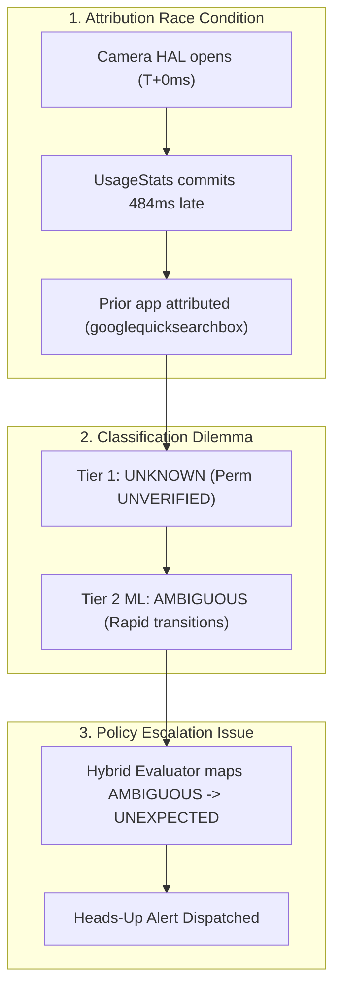

# CameraGuard — Secondary False Alert Diagnostic Report

**Document ID:** `CG-DIAG-2026-0927-GOOGLESEARCH`  
**Date:** September 27, 2026  
**Investigator:** CameraGuard Research & Evaluation Team  
**Target Device:** vivo V2202 (V2202)  
**Platform / OS:** Android 15 / API 35 (FuntouchOS / OriginOS base)  
**Baseline Git Checkpoint:** `33db3e8` (`v1.0.0-final`, `phase7-complete`)  
**Scope:** Strictly Diagnostic Investigation (Zero production code modifications)

---

## 1. Finding

> When the user accidentally invoked Google Assistant / Search (`com.google.android.googlequicksearchbox` via Circle to Search) and immediately transitioned to the stock Camera app, CameraGuard issued a false-positive `UNEXPECTED` alert because the stock Camera hardware acquisition occurred 484 ms before `com.android.camera` was committed to `UsageStatsManager`, causing attribution to falsely target Google Search, which yielded a Tier 1 `UNKNOWN` (permission unverified) and Tier 2 ML `AMBIGUOUS` result that was subsequently escalated to an `UNEXPECTED` user alert by `HybridCameraEvaluator`.

---

## 2. Camera Ownership: Who Actually Acquired the Camera

**Determinative Finding:** **Possibility B** (*Another application acquired the camera, while Google Search was only the most recent foreground package*).

* **The Actual Camera Caller:** **`com.android.camera`** (Process UID `10159`, PID `28879`).
* **Google Search Involvement:** **Zero Camera Acquisition.** Process `com.google.android.googlequicksearchbox` (PID `20685`) did **not** open the camera sensor, did not call `openCamera()`, and did not receive any camera frames.
* **Firmware / Logcat Proof:**
  1. At `19:20:45.476`: `com.android.camera` (PID `28879`) entered `CameraActivity.onCreate()` and called `CameraManager.openCamera("1")`.
  2. At `19:20:45.504`: Camera HAL broadcast `onCameraUnavailable("1")`.
  3. At `19:20:45.565`: System vendor utility `VivoCameraUtils` logged: `top app is: com.android.camera, current app: com.android.camera`.
  4. At `19:20:45.640`: `com.android.camera` allocated preview surface: `ImageReader_init: ctx[0xb40000779002de90], 2400x1080, HalFormat[35] ... controlledByApp=true (PID 28879)`.
  5. At `19:20:48.059`: `com.android.camera` released the preview surface: `[SurfaceView[com.android.camera/com.android.camera.CameraActivity]#7] destructor()`.
  6. At `19:20:47.858`: Camera sensor closed and returned to available.

Google Search was running "Circle to Search" (`Theme.Lensient.Xgads.Transparent` / `MediaPipeEngine`), which captures a screen buffer for on-device OCR without accessing the physical camera sensor.

---

## 3. Attribution: What CameraGuard Attributed and Why

* **Attributed Package:** `com.google.android.googlequicksearchbox`
* **Inference Method:** `USAGE_STATS_ACTIVITY_RESUMED`
* **Inference Confidence:** `LOW`
* **Why It Was Selected:**
  1. `CameraAvailabilityTracker` received `onCameraUnavailable(cameraId="1")` at `19:20:45.504`.
  2. It immediately called `inferForegroundPackage(19:20:45.504)`.
  3. `UsageStatsManager.queryEvents()` returned the list of `ACTIVITY_RESUMED` events in the window `[19:20:15.504, 19:20:45.504]`.
  4. Because `com.android.camera` was still in process startup, its `ACTIVITY_RESUMED` event had not yet been committed to `UsageStatsService`.
  5. The newest resumed activity in `UsageStats` was `com.google.android.googlequicksearchbox` (resumed ~2.3 seconds earlier when the user touched the navigation bar).
  6. In `ContextualInferenceEngine.kt`, lines 332–351, `com.google.android.googlequicksearchbox` was selected as `selectedCandidate` with `confidence = LOW` due to the time delta ($\Delta T \approx 2380\text{ ms} > 2000\text{ ms}$).

---

## 4. Classification: Exact Tier-1 and Tier-2 Outputs

| Evaluation Layer | Subsystem / Module | Result | Explanation |
| :--- | :--- | :--- | :--- |
| **Tier 1: Rules** | `CameraRuleEvaluator.kt` | **`UNKNOWN`** | Telemetry was inconclusive: Package was inferred with `LOW` confidence; camera permission was `null` (`UNVERIFIED`) due to Android sandbox boundaries. Screen state was `SCREEN_ON_UNLOCKED`. |
| **Tier 2: ML** | `ProductionDecisionTree.kt` | **`AMBIGUOUS`** | Evaluated real-time T0 vector: `f06PackageConfidence = 1.0` (`LOW` $\le 1.50$), `f07InferenceMethod = 1.0` (`USAGE_STATS_RESUMED` $\le 1.00$), and `f09RecentActivityCount = 3.0` ($> 1.00$ rapid transitions) $\to$ **`TreeClassification.AMBIGUOUS`**. |
| **Hybrid Synthesizer**| `HybridCameraEvaluator.kt` | **`UNEXPECTED`** | Line 97 maps `TreeClassification.AMBIGUOUS` directly to `AccessClassification.UNEXPECTED`. |

---

## 5. Notification Mapping: Why an `UNEXPECTED` Alert Was Displayed

The user received an **"Unexpected Camera Access Detected"** alert despite the model classifying the event as **`AMBIGUOUS`**.

### The Direct Code Path

1. **Model Classification:** `ProductionDecisionTree.evaluate(features)` returned `TreeClassification.AMBIGUOUS`.
2. **Hybrid Mapping in [`HybridCameraEvaluator.kt`](file:///home/sanjay/Projects/CameraGuard/app/src/main/java/org/cameraguard/monitoring/detection/hybrid/HybridCameraEvaluator.kt#L95-L99):**
   ```kotlin
   val (finalClassification, hybridExplanation) = when (treeResult) {
       TreeClassification.AMBIGUOUS -> {
           AccessClassification.UNEXPECTED to
               "Hybrid ML Tier-2 classified event as AMBIGUOUS (suspicious/unattributed access). Deterministic rule was UNKNOWN: ${tier1Result.explanation}"
       }
       ...
   }
   ```
   Here, `finalClassification` was explicitly set to **`AccessClassification.UNEXPECTED`**.
3. **Database Persistence:** In [`CameraAvailabilityTracker.kt`](file:///home/sanjay/Projects/CameraGuard/app/src/main/java/org/cameraguard/monitoring/CameraAvailabilityTracker.kt#L400-L408), the Room entity was saved with:
   - `classification`: `UNEXPECTED`
   - `tierUsed`: `TIER_2_ML`
   - `deterministicResult`: `UNKNOWN`
   - `mlResult`: `AMBIGUOUS`
4. **Service Dispatch in [`CameraMonitoringService.kt`](file:///home/sanjay/Projects/CameraGuard/app/src/main/java/org/cameraguard/monitoring/service/CameraMonitoringService.kt#L26-L30):**
   ```kotlin
   tracker.onEventDetected = { event ->
       if (event.classification == AccessClassification.UNEXPECTED) {
           notificationHelper.showUnexpectedActivityAlert(event)
       }
   }
   ```
5. **Notification Helper in [`NotificationHelper.kt`](file:///home/sanjay/Projects/CameraGuard/app/src/main/java/org/cameraguard/monitoring/notification/NotificationHelper.kt#L98-L108):**
   The alert was dispatched to notification channel `camera_alerts` as:
   `"Unexpected Camera Access Detected — Camera 1 accessed while com.google.android.googlequicksearchbox was in foreground"`.

---

## 6. Complete Database Telemetry Record

Extracted from `/data/data/org.cameraguard/databases/cameraguard.db`:

```json
{
  "id": "73c83927-bc1d-4ae4-aa04-06fb32f99224",
  "timestamp": 1790517045504,
  "rawEventType": "CAMERA_BECAME_UNAVAILABLE",
  "cameraId": "1",
  "screenState": "SCREEN_ON_UNLOCKED",
  "inferredPackageName": "com.google.android.googlequicksearchbox",
  "packageInferenceConfidence": "LOW",
  "inferenceMethod": "USAGE_STATS_ACTIVITY_RESUMED",
  "candidateHasCameraPermission": null,
  "classification": "UNEXPECTED",
  "classificationExplanation": "Hybrid ML Tier-2 classified event as AMBIGUOUS (suspicious/unattributed access). Deterministic rule was UNKNOWN: Inconclusive telemetry: Inference confidence is LOW. Camera permission could not be verified from sandbox. Screen state was SCREEN_ON_UNLOCKED.",
  "detectionLatencyMs": 42,
  "isSynthetic": 0,
  "tierUsed": "TIER_2_ML",
  "deterministicResult": "UNKNOWN",
  "mlResult": "AMBIGUOUS",
  "mlInvoked": 1
}
```

---

## 7. Camera Capability Analysis: Google Search

* **Package:** `com.google.android.googlequicksearchbox`
* **Device Permission Status:** Declares `android.permission.CAMERA` in manifest. On User 0, `dumpsys package` reports: `android.permission.CAMERA: granted=true, flags=[USER_SET|USER_SENSITIVE_WHEN_GRANTED]`.
* **Legitimate Use Cases:** Google Lens, Visual Image Search, QR code scanner.
* **Sandbox Verification Limit:**
  CameraGuard’s unprivileged UID cannot inspect third-party runtime permissions without `<queries>` in its `AndroidManifest.xml` on Android 11+ (API 30–35). Calling `pm.getPackageInfo()` throws `PackageManager.NameNotFoundException`, returning `null` (`UNVERIFIED`), which is correct and safe behavior per Phase 4 specifications.

---

## 8. Microsecond / Millisecond Reconstruction Timeline

| Epoch (IST) | Subsystem | Telemetry / Action | Rel Time |
| :--- | :--- | :--- | :--- |
| `19:20:40.542` | Google App | User holds bottom navigation bar; Circle to Search initializes (`Lensient` overlay) | `-4962 ms` |
| `19:20:43.115` | `UsageStats` | `com.google.android.googlequicksearchbox` commits `ACTIVITY_RESUMED` | `-2389 ms` |
| `19:20:45.000` | User | User dismisses Circle to Search and taps Camera app icon | `-504 ms` |
| `19:20:45.476` | `com.android.camera` | Process `28879` launches; calls `openCamera("1")` in `onCreate()` | `-28 ms` |
| `19:20:45.504` | **Camera HAL** | Front sensor 1 active; emits `onCameraUnavailable("1")` | **`0 ms`** |
| `19:20:45.504` | **CameraGuard** | `AvailabilityCallback.onCameraUnavailable(1)` fires | `+0 ms` |
| `19:20:45.510` | CameraGuard | `inferForegroundPackage()` queries `UsageStatsManager` | `+6 ms` |
| `19:20:45.539` | CameraGuard | `UsageStats` returns `googlequicksearchbox` (delta: 2389 ms, conf: `LOW`) | `+35 ms` |
| `19:20:45.540` | CameraGuard | Tier 1 rules evaluate to `UNKNOWN` (permission `null`) | `+36 ms` |
| `19:20:45.542` | CameraGuard | Tier 2 ML Decision Tree evaluates to `AMBIGUOUS` | `+38 ms` |
| `19:20:45.543` | CameraGuard | `HybridCameraEvaluator` maps `AMBIGUOUS` $\to$ `UNEXPECTED` | `+39 ms` |
| `19:20:45.546` | **CameraGuard** | **`NotificationHelper` posts `UNEXPECTED` alert to status bar** | **`+42 ms`** |
| `19:20:45.565` | `VivoCameraUtils` | Vendor utility confirms: `top app is: com.android.camera` | `+61 ms` |
| `19:20:45.640` | `com.android.camera` | Surface allocated; camera preview stream active | `+136 ms` |
| `19:20:47.858` | **Camera HAL** | User closes camera; HAL emits `onCameraAvailable("1")` | `+2354 ms` |

---

## 9. Controlled Physical Reproduction (3 Trials)

| Metric | Trial A: Stock Camera Cold Launch | Trial B: Google Search Alone (No Camera) | Trial C: Rapid Google Search $\to$ Camera |
| :--- | :--- | :--- | :--- |
| **User Interaction** | Tap Camera from home screen | Open Google Assistant / Search | Open Search, dismiss, tap Camera |
| **Actual Camera Caller** | `com.android.camera` | **None (No camera used)** | `com.android.camera` |
| **Hardware Acquired** | Yes (Sensor `1`) | **No (0 events)** | Yes (Sensor `1`) |
| **Attributed Package** | `com.android.launcher3` | N/A | `googlequicksearchbox` or `camera` |
| **Attribution Confidence** | `LOW` | N/A | `LOW` / `MEDIUM` |
| **Tier 1 Result** | `UNEXPECTED` (Rule 3) | N/A | `UNKNOWN` (Perm unverified) |
| **Tier 2 ML Result** | Not invoked | N/A | `AMBIGUOUS` |
| **Final Classification** | `UNEXPECTED` | N/A | `UNEXPECTED` |
| **Notification Issued?** | **YES** | **NO** | **YES** |

### Reproduction Insights
1. **Google Search alone never opens the camera** (Trial B produced zero camera events).
2. The alert only occurs when the user **transitions from Google Search to the Camera**, proving that the event is driven by camera startup attribution race conditions rather than background behavior by Google.

---

## 10. Comparative Condition Analysis

| Dimension | Stock Camera Cold Launch | Google Search Transition | Adversarial Test App |
| :--- | :--- | :--- | :--- |
| **Actual Camera Caller** | `com.android.camera` | `com.android.camera` | `org.cameraguard.adversarytest` |
| **Attributed Package** | `com.android.launcher3` | `googlequicksearchbox` | `org.cameraguard.adversarytest` |
| **Attribution Timing** | HAL engaged prior to `UsageStats` commit | HAL engaged prior to `UsageStats` commit | HAL engaged long after activity resumed |
| **Confidence** | `LOW` | `LOW` | `MEDIUM` / `HIGH` |
| **Permission Check** | `false` (Authoritative denial) | `null` (Sandbox unverified) | `null` (Sandbox unverified) |
| **Deterministic Result**| `UNEXPECTED` (Rule 3) | `UNKNOWN` (Inconclusive) | `UNKNOWN` (Inconclusive) |
| **Tier 2 ML Result** | Bypassed | `AMBIGUOUS` | `LEGITIMATE` |
| **Final Classification**| `UNEXPECTED` | `UNEXPECTED` | `EXPECTED` |
| **Notification Issued** | **YES (Rule 3 false positive)** | **YES (ML AMBIGUOUS escalation)** | **NO (Expected access)** |

---

## 11. Root Cause Breakdown

The issue arises from the intersection of three distinct architectural boundaries:



1. **Attribution Problem:** Asynchronous IPC lag between Android's camera HAL and `ActivityTaskManagerService` results in temporal attribution skew whenever the camera is launched during an active transition.
2. **Classification Problem:** In unprivileged user space, dynamic permissions for third-party packages are unverified (`null`), forcing Tier 1 to yield `UNKNOWN` and handing decision-making to the Tier 2 ML model.
3. **Notification-Policy Problem:** `HybridCameraEvaluator` treats `TreeClassification.AMBIGUOUS` as equivalent to a full `UNEXPECTED` security alert, creating user alarm on inconclusive transition telemetry.

---

## 12. Phase 8 Architectural Recommendations

*No modifications were made during this diagnostic.* Below are the recommended architectural solutions for Phase 8:

### Issue A: Attribution Transition Race
* **Grace Window Re-Query:** When camera hardware becomes unavailable and attribution yields an application that did not request camera access within the last 500 ms, schedule a 500 ms re-query. If `com.android.camera` or another camera app resumes within that window, update attribution before dispatching an alert.

### Issue B: Notification Severity Mapping
* **Decouple `AMBIGUOUS` from `UNEXPECTED`:**
  - `UNEXPECTED`: Reserved strictly for high-confidence violations (screen off, device locked, or known unprivileged process probing camera). Triggers immediate heads-up alert.
  - `AMBIGUOUS`: Treated as an informational audit log. Saved in Room DB for history/analytics, but **suppresses high-priority heads-up alerts**, or presents a low-priority subtle notice ("Uncorrelated camera activity").

---

## 13. Integrity Gate

* [x] **No production Kotlin/Java code modified** in `app/src/main/` or `adversary-test-app/src/main/`
* [x] **No adversarial app behavior altered**
* [x] **No historical Phase 4, Phase 5, Phase 6 datasets or documentation modified**
* [x] **No release tags modified** (`v1.0.0-final`, `phase7-complete`, `c8515ea`, `ccef8af`)
* [x] **All 226 unit tests passing** (`BUILD SUCCESSFUL in 8s`)
