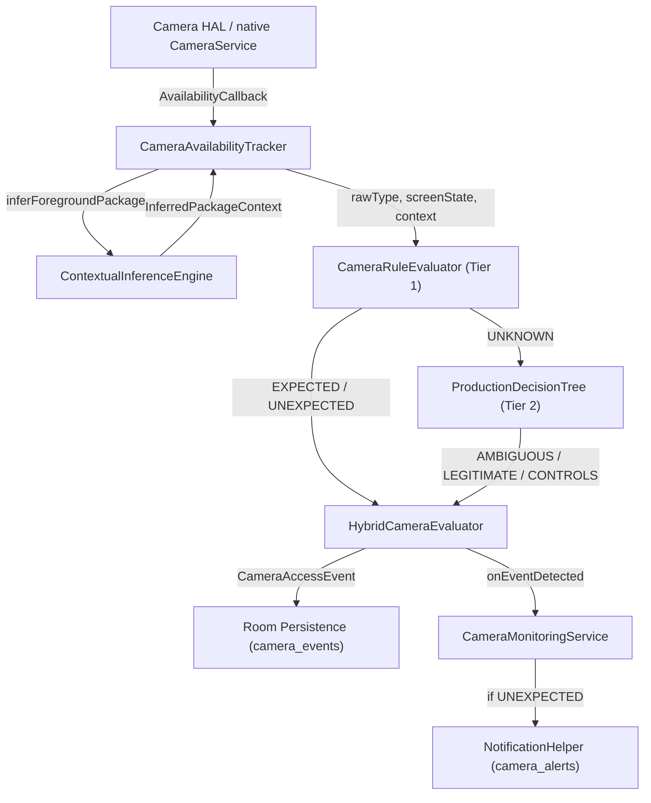

# CameraGuard — Phase 8 Architecture Trace

**Document ID:** `CG-DOC-P8-004-ARCHTRACE`  
**Date:** September 27, 2026  
**Investigator:** Lead Systems & Research Engineer  

---

## 1. End-to-End Pipeline Architecture

The complete production observation and decision pipeline runs through eight key components:



---

## 2. In-Depth Component Analysis

### 2.1 Where Camera Hardware Transition is Received
* **Location:** [`CameraAvailabilityTracker.kt`](file:///home/sanjay/Projects/CameraGuard/app/src/main/java/org/cameraguard/monitoring/CameraAvailabilityTracker.kt#L112-L170), lines 112–170.
* **Mechanism:** Registered with Android `CameraManager.registerAvailabilityCallback(availabilityCallback, handler)`.
* **State Machine:**
  - `onCameraUnavailable(cameraId)` and `onCameraAvailable(cameraId)` are received on the callback thread.
  - The first callback for each ID establishes baseline and suppresses event generation.
  - Successive identical callbacks are dropped as duplicates.
  - Differing callbacks execute `handleCameraTransition(cameraId, rawType, currentTime)`.

### 2.2 When Foreground Attribution Occurs
* **Location:** [`CameraAvailabilityTracker.kt`](file:///home/sanjay/Projects/CameraGuard/app/src/main/java/org/cameraguard/monitoring/CameraAvailabilityTracker.kt#L357-L375), lines 357–375.
* **Timing:** Executes **synchronously** immediately upon receiving `CAMERA_BECAME_UNAVAILABLE`.
* **Vulnerability:** Hardware transitions take 50–150 ms from `openCamera()`, while cold activity launch takes 400–800 ms to commit `ACTIVITY_RESUMED` in `UsageStatsService`. Attribution is attempted before the system server has registered the new activity.

### 2.3 How UsageStats is Queried
* **Location:** [`ContextualInferenceEngine.kt`](file:///home/sanjay/Projects/CameraGuard/app/src/main/java/org/cameraguard/monitoring/telemetry/ContextualInferenceEngine.kt#L183-L247), lines 183–247.
* **Window:** `[eventTimestamp - correlationWindowMs, eventTimestamp]` (30,000 ms lookback).
* **Selection:** Iterates through `UsageEvents`, filtering for `UsageEvents.Event.ACTIVITY_RESUMED`.
* **Transition Window:** Non-CameraGuard candidates within `TRANSITION_LOOKBACK_WINDOW_MS = 5000L` are prioritized.

### 2.4 How Attribution Confidence is Calculated
* **Location:** [`ContextualInferenceEngine.kt`](file:///home/sanjay/Projects/CameraGuard/app/src/main/java/org/cameraguard/monitoring/telemetry/ContextualInferenceEngine.kt#L336-L341), lines 336–341.
* **Formula:**
  $$\Delta T = T_{\text{event}} - T_{\text{candidate\_resumed}}$$
  - $\Delta T \le 500\text{ ms} \implies \text{HIGH}$
  - $\Delta T \le 2000\text{ ms} \implies \text{MEDIUM}$
  - $\Delta T > 2000\text{ ms} \implies \text{LOW}$

### 2.5 How Permissions Are Represented
* **Location:** [`ContextualInferenceEngine.kt`](file:///home/sanjay/Projects/CameraGuard/app/src/main/java/org/cameraguard/monitoring/telemetry/ContextualInferenceEngine.kt#L358-L400), lines 358–400.
* **Representation:** Tri-state `Boolean?`:
  - `true`: Package declared `CAMERA` and `PackageManager.checkPermission == PERMISSION_GRANTED`.
  - `false`: Package manifest authoritatively does not request `android.permission.CAMERA`.
  - `null` (`UNVERIFIED`): Third-party package whose dynamic permission state cannot be inspected from the sandbox due to API 30+ package visibility.

### 2.6 How Tier 1 Handles UNKNOWN
* **Location:** [`CameraRuleEvaluator.kt`](file:///home/sanjay/Projects/CameraGuard/app/src/main/java/org/cameraguard/monitoring/detection/CameraRuleEvaluator.kt#L85-L103), lines 85–103.
* If screen is on, unlocked, but confidence is `LOW` or permission is `null`, rules cannot decisively assert `EXPECTED` or `UNEXPECTED`. Tier 1 outputs `AccessClassification.UNKNOWN`.

### 2.7 How Tier 2 Handles AMBIGUOUS
* **Location:** [`ProductionDecisionTree.kt`](file:///home/sanjay/Projects/CameraGuard/app/src/main/java/org/cameraguard/monitoring/detection/hybrid/ProductionDecisionTree.kt#L35-L62), lines 35–62.
* When Tier 1 is `UNKNOWN`, the 11-feature T0 vector is passed to the decision tree.
* If `f06PackageConfidence <= 1.50` (`LOW`) and recent transitions `f09 > 1.00`, the tree outputs `TreeClassification.AMBIGUOUS`.

### 2.8 How HybridCameraEvaluator Synthesizes the Result
* **Location:** [`HybridCameraEvaluator.kt`](file:///home/sanjay/Projects/CameraGuard/app/src/main/java/org/cameraguard/monitoring/detection/hybrid/HybridCameraEvaluator.kt#L96-L108), lines 96–108.
* **The Critical Escalation Point:**
  ```kotlin
  TreeClassification.AMBIGUOUS -> {
      AccessClassification.UNEXPECTED to
          "Hybrid ML Tier-2 classified event as AMBIGUOUS (suspicious/unattributed access)."
  }
  ```
  `AMBIGUOUS` is directly synthesized into `AccessClassification.UNEXPECTED`.

### 2.9 How Notifications Are Triggered
* **Location:** [`CameraMonitoringService.kt`](file:///home/sanjay/Projects/CameraGuard/app/src/main/java/org/cameraguard/monitoring/service/CameraMonitoringService.kt#L26-L30), lines 26–30.
* **Trigger:**
  ```kotlin
  tracker.onEventDetected = { event ->
      if (event.classification == AccessClassification.UNEXPECTED) {
          notificationHelper.showUnexpectedActivityAlert(event)
      }
  }
  ```
* Any event marked `UNEXPECTED` automatically fires an immediate high-priority heads-up alert.

### 2.10 Can Database State and Notification State Diverge?
* In Room SQLite DB (`camera_events`):
  - Column `classification` stores `UNEXPECTED`.
  - Column `deterministicResult` stores `UNKNOWN`.
  - Column `mlResult` stores `AMBIGUOUS`.
* The database persists the detailed audit trail (`mlResult: AMBIGUOUS`), but the overarching `classification` column is collapsed to `UNEXPECTED`, exactly matching the notification trigger.
* **Deficiency:** There is no distinct `AMBIGUOUS` access classification in `AccessClassification.kt`, meaning inconclusive events cannot be represented as uncertain without triggering security notifications!
